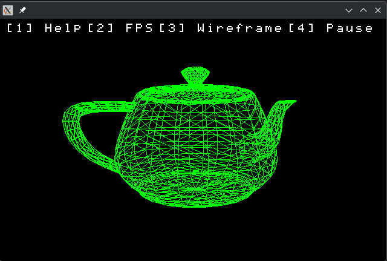

# SoftwareRenderer

SoftwareRenderer is a **CPU-based software rendering engine written in C**.
It demonstrates fundamental graphics techniques by implementing a **basic rendering pipeline entirely in software**, without relying on GPU APIs such as **OpenGL, Vulkan, or DirectX**.
The project is designed for **learning, experimentation, and understanding how real rendering pipelines work internally**.

---

# Demo

### Teapot Mesh Rendering



---

# Features

Current capabilities of the renderer:

### Rendering

* CPU-based software rasterization
* Wireframe rendering
* Point rendering
* Indexed mesh rendering
* Custom framebuffer
* Primitive rendering API

### Camera

* First-person camera movement
* Local-space camera translation
* Yaw / pitch camera rotation

### UI / Debug

* On-screen text rendering
* FPS counter
* Simple interactive menu
* Toggleable rendering modes

### Platform Layer

* Platform abstraction for windowing and input
* Framebuffer presentation
* Event handling

---

# Demo Controls

| Key            | Action             |
| -------------- | ------------------ |
| **W**          | Move forward       |
| **S**          | Move backward      |
| **A**          | Move left          |
| **D**          | Move right         |
| **Q**          | Move up            |
| **E**          | Move down          |
| **Arrow Keys** | Rotate camera      |
| **1**          | Toggle help        |
| **2**          | Toggle FPS counter |
| **3**          | Toggle wireframe   |
| **4**          | Pause movement     |

---

# Example Usage

Basic renderer usage:

```c
renderer_context_t *ctx = renderer_create(640, 400);

while (!platform_should_close())
{
    renderer_begin_frame(ctx);

    renderer_clean(ctx, 0xFF000000);

    renderer_begin(ctx, R_PRIMITIVE_LINE);

    float v1[3] = {0,0,0};
    float v2[3] = {1,0,0};

    renderer_vertex(ctx, v1, 3);
    renderer_vertex(ctx, v2, 3);

    renderer_end_frame(ctx);
}

renderer_destroy(ctx);
```

---

# Build

The project uses **CMake workflows**.

## Native build

```bash
cmake --workflow native
```

## Windows build (MinGW from Linux)

```bash
cmake --workflow mingw
```

---

# Project Structure

```
renderer/
    renderer.h      Public renderer API
    renderer.c      Core renderer implementation

renderer/platform/
    platform layer (window, input, presentation)

resources/
    teapot.h        Demo mesh data

docs/images/
    Screenshots for README
```

---

# Contributing

1. Create a branch from `development`
2. Open a pull request
3. Assign **T1ag0Card0s0** as reviewer

### Requirements

* No failing builds
* The demo must run on all platforms in `platform/`
* Code must be formatted before submitting

```bash
cmake --workflow native
cmake --build build --target format
```

---

# License

This project is licensed under the **MIT License**.

See the `LICENSE` file for details.

